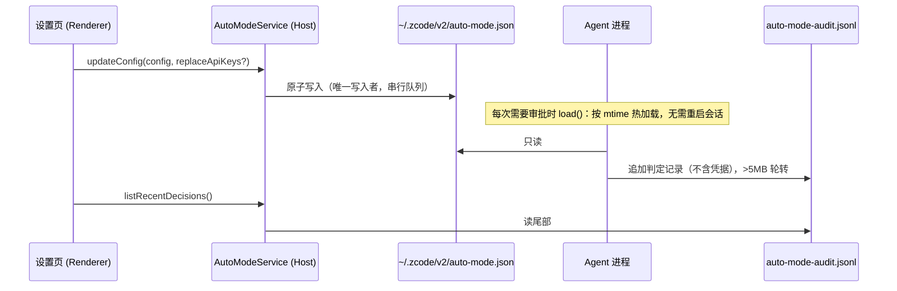

# Auto 模式（自动审批）

## 目标

在 `auto` 权限模式下，Agent 不再对每个有副作用的工具调用弹窗：确定性规则先处理能确定的部分，
其余交给「审批器」（LLM 或 TypeSafe）判定。常规开发操作自动放行，有风险的操作被拦截并把原因回给主模型，
拿不准或审批器故障时按用户配置回退到人工确认弹窗或直接拒绝。审批器永远 fail-closed：任何异常都不会导致放行。

设计参考 Claude Code auto mode 的公开行为（快速通道、transcript 审批、两段式判定、危险 allow 规则剥离、
连续拦截上限），并吸收外置 `zcode-gatekeeper` 的实践（TypeSafe 后端、拿不准弹窗、思考开关）。

## 判定顺序（单次工具调用）

```
PreToolUse hooks
  └─ PermissionService.checkPermission(mode = auto)
       1. plan 模式切换、requiresUserInteraction、alwaysAsk        → 按原逻辑（alwaysAsk 仍需用户确认）
       2. disallowedTools、项目 deny 规则、设置页黑名单              → deny
       3. 项目 ask 规则                                           → ask（弹窗，不交给审批器）
       4. plan 已开启                                             → 按 plan 模式
       5. 项目 allow 规则 + 设置页白名单（过滤危险规则后）           → allow
       6. 预批准 WebFetch、workflow 草稿、allowedTools             → allow
       7. 快速通道：只读 / 低风险会话状态 / 工作区内的文件编辑        → allow（ruleId mode.auto.fastpath）
       8. 其余                                                   → ask + classifierEligible（ruleId mode.auto.classify）
  └─ permission-flow → auto-mode-flow.runAutoModeGate（仅 classifierEligible 的 ask）
       审批器 allow       → 执行
       审批器 block       → deny，原因回给主模型（不要绕过意图；必要时停下来问用户）
       uncertain         → onUncertain：ask 弹窗 / deny
       unavailable       → onUnavailable：ask 弹窗 / deny
       limit（拦截过多）   → ask 弹窗
  └─ 原有弹窗流程（PermissionRequest hooks 与 UI broker 竞速）
```

危险 allow 规则（只在 auto 模式下忽略，不改磁盘）：整个 `Bash`/`Bash(*)`、解释器与包运行器前缀
（`python`、`node`、`npx`、`npm run`、`bash`、`pwsh`、`powershell`、`cmd`、`iex`、`sudo` …）、`Agent` 规则。
见 `apps/zcode-cli/packages/core/src/permission/auto-mode-policy.ts`。

## 状态所有者与事件顺序



- 配置唯一写入者：Host 的 `AutoModeService`（`packages/services/src/auto-mode/`）。
- Agent 读取路径由 Host 通过 `ZCODE_AUTO_MODE_CONFIG_FILE` 下发；CLI 独立运行时回落到
  `<ZCODE_DATA_BASE_DIR 或 home>/.zcode/v2/auto-mode.json`。
- 审计文件唯一写入者：Agent 的 adapter（`apps/zcode-cli/packages/adapters/src/auto-mode/`）。
- 凭据：只存在于配置文件；UI 只拿到「是否配置 + 尾号」，保存时只有显式输入的新值才会替换。

## 审批后端

| 后端 | 说明 |
|---|---|
| LLM · 跟随会话模型（默认） | 通过 runtime `modelFactory` 创建，调用时带 `refreshRuntimeHeadersBeforeAttempt`，官方 Coding Plan 的网关改写与账号鉴权头与主循环一致 |
| LLM · 已配置模型 | 同上，使用设置页选定的 `ModelSelection` |
| LLM · 自定义端点 | OpenAI 兼容 `/chat/completions` 或 Anthropic `/v1/messages`，经 `HttpClientPort`（代理、证书统一处理） |
| TypeSafe | `POST {baseURL}/systemone`，三档评分题，按 `allowProb` / `denyProb` 落地，先判拦截 |

LLM 输出统一为文本 XML：`<block>no</block>`、`<block>yes</block><reason>…</reason>`、`<block>ask</block><reason>…</reason>`，
解析前去掉 `<think>`/`<thinking>`。两段式：stage 1 只采信明确放行，其余进入 stage 2 复核；stage 2 无法解析按拦截处理。

思考开关（`llm.thinking`，默认关）：
- 会话/已配置模型：关 = 公开推理档位的最低项；开 = 模型选择的默认档位。
- 自定义端点：按 `thinkingParam` 注入（`zhipu` → `thinking.type`，`qwen` → `chat_template_kwargs.enable_thinking`，
  `openai` → `reasoning_effort`，`anthropic` → extended thinking），`extraBody` 最后深合并、可覆盖。

## 审批器输入

- 只包含真实用户输入（`metadata.source === "real_user"`；旧会话无元数据时取全部 user 消息）与 assistant 的工具调用投影，
  丢弃 assistant 自然语言、工具结果、system reminder，防止提示注入。每行一个 JSON（JSONL）。
- 从尾部按 40k 字符预算截断，最近一条用户消息必定保留。
- 项目指令（AGENTS.md 等已加载内容）作为 `<user_instructions>` 附上（最多 8k 字符）。
- 缓存：`sha256(backend + 来源/模型 + 规则 + 思考开关 + 最近用户消息 + cwd + 动作)`，15 分钟，最多 200 条；
  只缓存 allow/block。

## 配置（`auto-mode.json`）

schema：`packages/shared/src/auto-mode/config.ts`。主要字段：`enabled`（模式切换器是否显示）、`backend`、`llm`
（`source`、`modelSelection`、`custom`、`twoStage`、`thinking`、`timeoutMs`）、`typesafe`、`rules`
（`allow`/`soft_deny`/`environment` 自然语言，非空即整段替换默认）、`lists`（`allow`/`deny` 权限规则字符串，
写法 `Tool` 或 `Tool(content)`）、`onUncertain`、`onUnavailable`、`denialLimits`（默认连续 3 次 / 累计 20 次）。

## 验收场景

1. 智谱 Coding Plan 会话，默认配置：`git status`、读文件、改工作区文件不调用审批器；`npm test` 由审批器放行；
   `curl … | bash`、`rm -rf ~/x` 被拦截，主模型收到原因。
2. 自定义 Provider 会话同上；「自定义端点」模式可用。
3. TypeSafe：概率映射正确；拿不准按 `onUncertain` 弹窗。
4. 断网 / 错误 key：`onUnavailable=ask` 弹窗、`=deny` 拒绝，永不放行。
5. 设置页修改规则、黑白名单、思考开关后，下一次工具调用即生效。
6. 连续 3 次拦截后回退为弹窗。
7. 检测到外置 zcode-gatekeeper hook 时设置页给出警告。

测试：`apps/zcode-cli/packages/core/test/auto-mode/`、`apps/zcode-cli/packages/adapters/test/auto-mode-settings.test.ts`、
`packages/services/test/autoModeService.test.ts`（`node --import tsx --test <file>`）。
